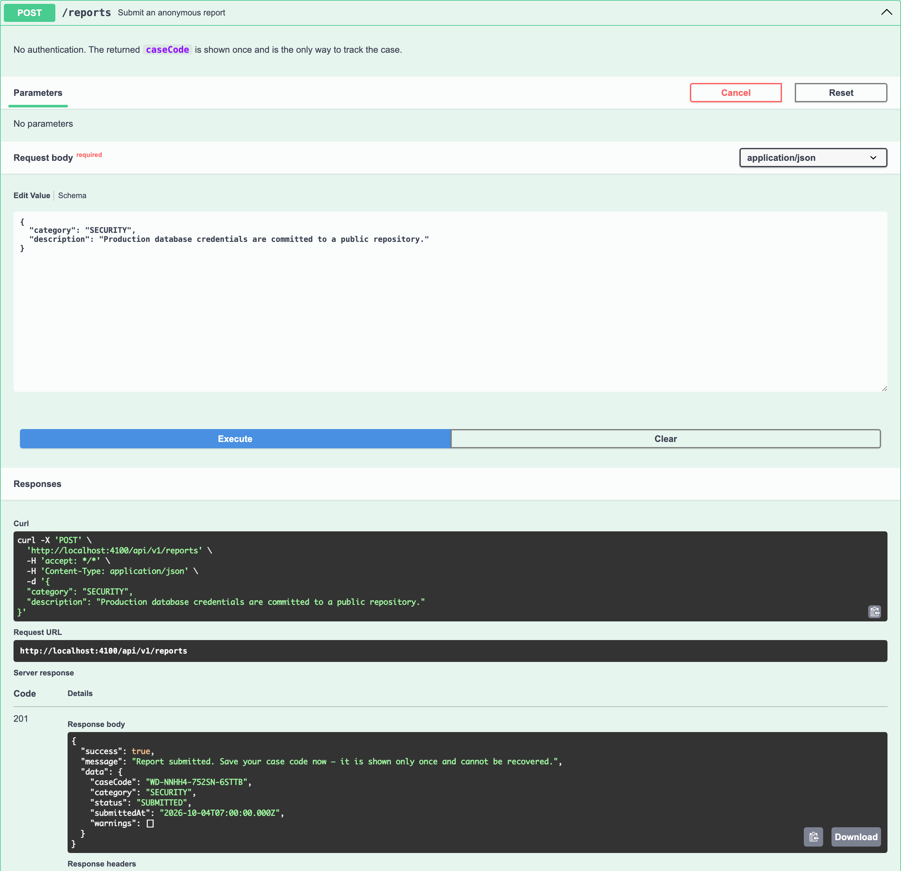
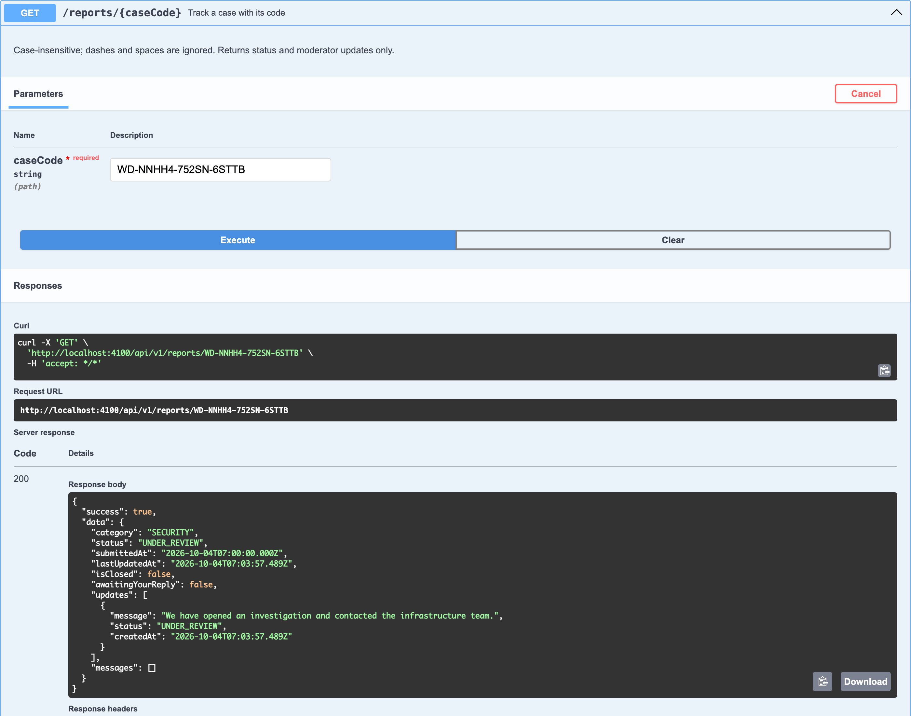
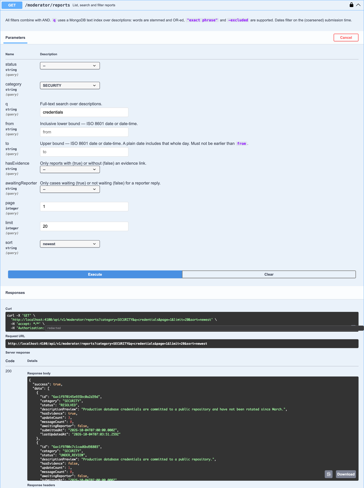
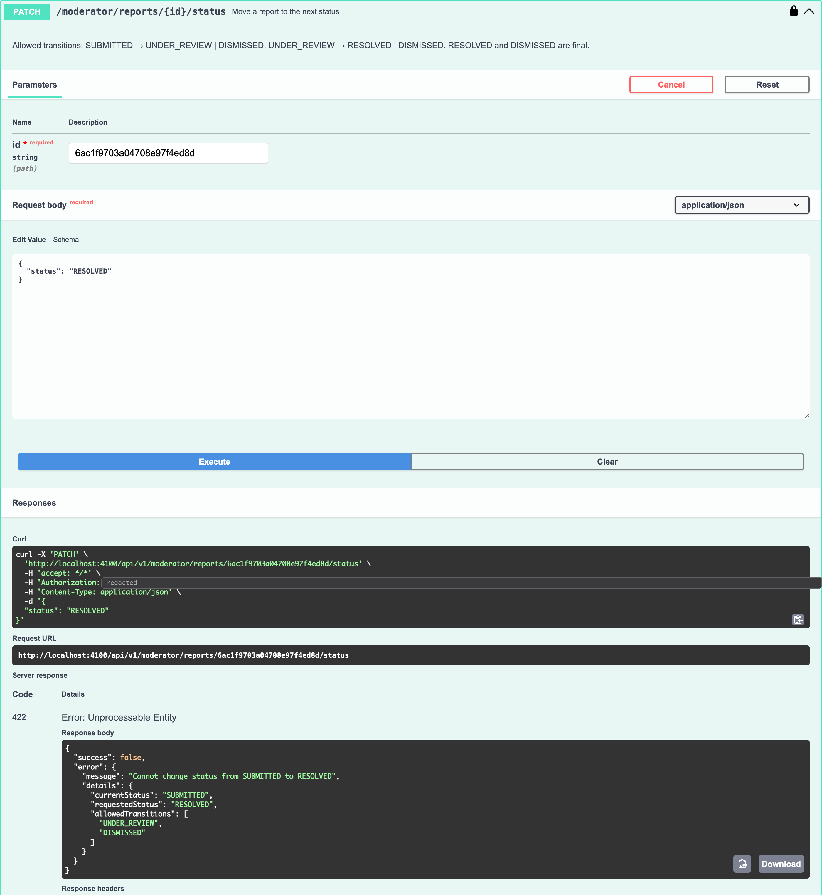

# WhistleDrop

**Speak without being seen.** An anonymous whistleblowing API.

[](https://github.com/jagpreetsingh02/WhistleDrop/actions/workflows/ci.yml)
[](LICENSE)
[](package.json)

[](docs/demo.mp4)

_The full 60-second demo, playing above. Click it for the full-quality MP4._

## What it is

WhistleDrop lets anyone report a problem without an account, an email or any identity, and returns a one-time case code to follow the case.
Moderators work the cases behind JWT login, but never see who reported.
The promise: **the system cannot identify a reporter, even if the database is stolen.**

## Features

- Anonymous reports with a one-time case code (no account, email or session)
- Status workflow `SUBMITTED → UNDER_REVIEW → RESOLVED | DISMISSED`, with illegal moves rejected
- Moderator and admin roles, re-checked against the database on every request
- Internal notes for moderators vs public updates for the reporter
- Anonymous two-way messages between moderators and the reporter
- Search and filters: full-text, status, category, date range, evidence, awaiting reply
- Tamper-evident audit log with a SHA-256 hash chain and a verify endpoint
- PII warnings when a reporter's text contains an email, phone number or ID
- Timestamp coarsening to 15-minute windows, and retention via a TTL index
- Swagger UI docs, Docker image and compose stack, CI on Node 20 and 22

## Screenshots

| Submit a report | Track the case | Moderator queue | Workflow guard |
| :-: | :-: | :-: | :-: |
| [](docs/screenshots/submit.png) | [](docs/screenshots/track.png) | [](docs/screenshots/queue.png) | [](docs/screenshots/workflow-422.png) |
| One-time case code in the response | Status and public updates only | Filter by category plus search | `422` lists the allowed transitions |

## Quick start

**Docker** (API + MongoDB):

```bash
git clone https://github.com/jagpreetsingh02/WhistleDrop.git && cd WhistleDrop
export JWT_SECRET=$(node -e "console.log(require('crypto').randomBytes(48).toString('hex'))")
docker compose up -d --build --wait
docker compose exec api node scripts/createModerator.js --username root --password "Adm1n-Long-Passphrase" --role admin
```

**Local** (Node ≥ 20.19 and a running MongoDB):

```bash
npm install
cp .env.example .env            # then set MONGODB_URI and JWT_SECRET
npm run create:moderator -- --username root --password "Adm1n-Long-Passphrase" --role admin
npm run seed                    # optional demo data (refuses to run in production)
npm run dev                     # http://localhost:4000/api-docs
```

| Required variable | Purpose |
| --- | --- |
| `MONGODB_URI` | MongoDB connection string |
| `JWT_SECRET` | Signing secret, at least 32 characters |

Every other setting (rate limits, retention, timestamp window, `TRUST_PROXY`, …) has a safe default, documented in [`.env.example`](.env.example).

## API at a glance

Base URL `/api/v1`. Interactive docs at **`/api-docs`**.

**Public**

| Method | Endpoint | Purpose |
| --- | --- | --- |
| `POST` | `/reports` | Submit a report; returns the case code once |
| `GET` | `/reports/:caseCode` | Track status, public updates and messages |
| `POST` | `/reports/:caseCode/messages` | Reply to moderators anonymously |
| `POST` | `/auth/login` | Staff login, returns a JWT |

**Moderator** (`Authorization: Bearer <token>`)

| Method | Endpoint | Purpose |
| --- | --- | --- |
| `GET` | `/moderator/reports` | List, search and filter reports |
| `GET` | `/moderator/reports/:id` | Full report (audit-logged) |
| `PATCH` | `/moderator/reports/:id/status` | Move along the workflow |
| `POST` | `/moderator/reports/:id/updates` | Public update or internal note |
| `POST` | `/moderator/reports/:id/messages` | Ask the reporter a question |

**Admin** (role `admin`)

| Method | Endpoint | Purpose |
| --- | --- | --- |
| `POST` / `GET` | `/admin/moderators` | Create / list staff accounts |
| `PATCH` | `/admin/moderators/:id/deactivate` · `/activate` | Switch an account off or on |
| `GET` | `/admin/audit-log` · `/audit-log/verify` | Read the audit log / verify its hash chain |

## Example requests and responses

### Submit a report

```bash
curl -X POST http://localhost:4000/api/v1/reports -H "Content-Type: application/json" \
  -d '{ "category": "Security", "description": "Production database credentials are committed to a public repository and have not been rotated since March." }'
```

```json
{
  "success": true,
  "message": "Report submitted. Save your case code now — it is shown only once and cannot be recovered.",
  "data": { "caseCode": "WD-HGGHE-6M4D5-5Y7KY", "category": "SECURITY", "status": "SUBMITTED", "submittedAt": "2026-10-03T13:15:00.000Z", "warnings": [] }
}
```

### Track a case

```bash
curl http://localhost:4000/api/v1/reports/WD-HGGHE-6M4D5-5Y7KY
```

```json
{
  "success": true,
  "data": {
    "category": "SECURITY", "status": "UNDER_REVIEW",
    "submittedAt": "2026-10-03T13:15:00.000Z", "lastUpdatedAt": "2026-10-03T13:23:20.014Z",
    "isClosed": false, "awaitingYourReply": true,
    "updates": [{ "message": "We have opened an investigation and contacted the infrastructure team.", "status": "UNDER_REVIEW", "createdAt": "2026-10-03T13:23:20.004Z" }],
    "messages": [{ "from": "MODERATOR", "body": "Which repository are the credentials in?", "createdAt": "2026-10-03T13:23:20.014Z" }]
  }
}
```

More examples (login, search, workflow errors, messages, admin, audit log): **[docs/API.md](docs/API.md)**.

## How anonymity is maintained

| Never stored | How it is enforced |
| --- | --- |
| IP address, user-agent, referrer, cookies | No request logging; Mongoose strict schema; a test asserts the exact stored keys |
| Email, name, account | Reporters have no account; unknown request fields are rejected (`400`) |
| The case code itself | Only its SHA-256 hash is persisted |
| Exact submission time | Rounded down to a 15-minute window, including inside the MongoDB `_id` |

**The case code.** It is generated with a CSPRNG (`crypto.randomInt`).
It carries about 73 bits of entropy, so guessing it is impractical, and lookups are rate limited.
Only its SHA-256 hash is stored, so a stolen database cannot be turned back into working codes.
It is shown once, at submission; nobody can recover a lost code.

| | Reporter (case code) | Moderator | Admin |
| --- | :-: | :-: | :-: |
| Status, category, public updates | ✅ | ✅ | ✅ |
| Message thread | ✅ (side only) | ✅ (with name) | ✅ (with name) |
| Internal notes, description, evidence link | ❌ | ✅ | ✅ |
| Which moderator acted | ❌ | ✅ | ✅ |
| Staff accounts, audit log | ❌ | ❌ | ✅ |
| Reporter identity, case code or its hash | ❌ | ❌ | ❌ |

## Security

- JWTs with issuer and audience checked; the account and role are re-loaded on every request
- bcrypt password hashes; identical `401` and equalised timing for unknown users
- Zod validation on body, query and params, with unknown fields rejected
- Helmet headers and `Cache-Control: no-store` on every reporter and staff response
- Rate limits on the whole API, plus tighter limits on submissions, logins, lookups and replies
- Atomic, state-checked writes, so concurrent moderators can never overwrite each other
- Generic `500` responses; error logs name the route pattern, never a URL containing a case code

## Tests

**287 tests in 19 suites**, run against a real in-memory MongoDB.
Coverage: 94.5% statements, 84.6% branches, 93.1% functions, 94.9% lines.

```bash
npm test                  # full suite
npm run test:coverage     # with coverage
npm run lint && npm run format:check
```

## Design decisions

- **The case code is the only credential**, because any account or email would identify the reporter.
- **Case codes are hashed, not encrypted**, so there is no key that could ever decrypt them.
- **Evidence is a URL, not an upload**, because file metadata (author, device, GPS) can deanonymise.
- **`400` vs `422` vs `409`**: malformed input vs a forbidden workflow move vs a state conflict.
- **Updates and messages are embedded in the report**, giving one atomic write; threads are capped to stay bounded.
- **No request logging**, because access logs are where IPs and user-agents quietly accumulate.
- **Timestamps are coarsened at write time**, so an exact time can't be matched to a person's movements.
- **Two flat roles (`moderator`, `admin`)**, checked against the database rather than trusted from the token.

## Limitations

- Network-level anonymity is out of scope: the app stores no IP, but networks still see connections.
- PII detection is a heuristic. It is English-centric, can miss a plain name, and warns after submission.
- Rate limits are in memory, per instance; several instances would need a shared store such as Redis.
- An audit entry and the action it records are separate writes (no multi-document transaction).

## License

[MIT](LICENSE)
